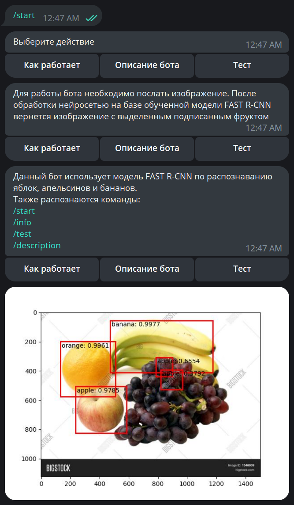
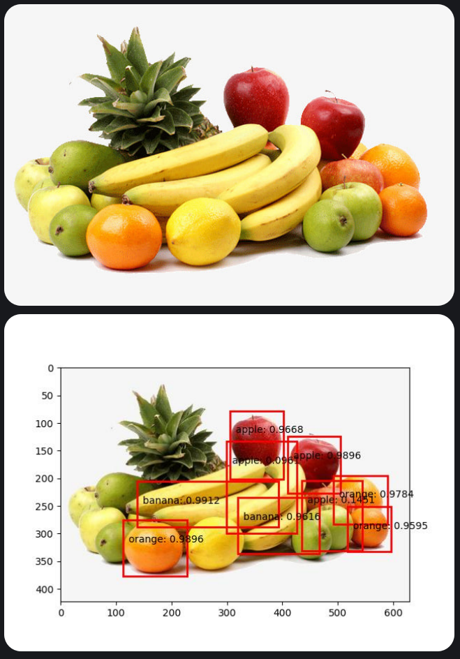

# TG Bot with PyTorch model

Обученная модель fast_rcnn_model.pt занимат порядка 160мб и не помещается в репозитории github

## Disclaimer

Проект в стадии разработки и адаптации под модель FAST R-CNN

Реализовано в статусе первого mvp:
1. Сделан скелет приложения
2. Сформировано два тестовых файла для проверки версии python и для тестирования API
3. С помощью api_test можно отослать через POST запрос файл на запущенный сервер
4. Реализован запуск вебсервера на flask
5. Описаны необходимые библиотеки для работы с моделью FAST R-CNN в файле requirements.txt
6. Для работы используется pytorch 13 и CUDA 11.7
7. Подготовлена рабочая дообученная модель FAST R-CNN
8. В my_detection.ipynb выложен подробный процесс обучения и сохранения модели
9. Модель требует работы с GPU и CUDA
10. Реализована загрузка модели в веб приложение, полученя изображения, подготовки его для использования в модели
11. Реализовано получение prediction от модели
12. Добавлена функция nms, реализующая  алгоритм Non-maximum Suppression
13. Реализован текстовый ответ на тестовое изображение
14. Реализован алгоритм единичного распознавания главного(с наибольшим скором) объекта на тестовом изображении
15. Добавлена библиотека aiogram для реализации телеграм бота
16. Реализован тг бот
17. Добавлены взаимодействия через хендлеры и коллбеки
18. Добавлен обработчик получения изображения, выделения объекта (апельсин, банан, яблоко) и отправка обратно пользователю
19. Сделан небольшой рефакторинг
20. Отредактировано визуальное представление бота, добавлена информация о модели бота и о работе бота
21. Добавлены команды: /start /info /description /test
22. Команда /test или кнопка "Тест" позволяет взять из тестовой базы изображение, обработать нейросетью и отправить пользователю
23. Сделан рефакторинг кода, исправлены баги, связанные с генераций изображения
24. Добавлен score для найденных объектов, показывающий точность определения
25. Добавлен конфиг для сборки docker образа 

## Demo работы бота

## Запуск

Для запуска веб-контейнера необходимо перейти в service и запустить start_app.py
Для теста через веб-контейнер необходимо перейти в tests и запустить api_test.py

Для запуска тг-бота необходимо перейти в app/bot и запустить bot.py.
Для теста сервиса predict необходимо перейти в tests и запустить predict_test.py

## Log:

Loading PyTorch model and Flask starting server.
Please wait until server has fully started...
Is CUDA supported by this system? True
CUDA version: 11.7
ID of current CUDA device:0
Name of current CUDA device:NVIDIA GeForce RTX 3090 Ti
* Serving Flask app 'api'
* Debug mode: on

***
<class 'torch.Tensor'>\
[{'boxes': tensor([[ 68.5390,  62.2780, 180.9433, 162.6742],\
[109.5106, 116.6273, 218.8277, 222.4048],\
[209.0050, 143.4062, 298.8925, 226.9113],\
[ 12.0190,  24.5841,  99.9162,  99.0302],\
[209.1016, 142.0529, 300.0000, 226.1681],\
[104.7043, 100.3560, 221.1093, 229.0000],\
[209.6621, 145.8296, 291.8750, 226.5049],\
[ 69.4276,  56.2068, 218.0771, 177.7239],\
[  6.3519,  21.3432, 104.0385, 102.8566],\
[ 65.6014,  60.9822, 177.3932, 161.7981],\
[ 11.9727,  25.5773,  93.6112,  99.4727]], device='cuda:0'),\

'labels': tensor([1, 1, 1, 1, 3, 3, 2, 3, 3, 2, 2], device='cuda:0'),\

'scores': tensor([0.9491, 0.8802, 0.4843, 0.2963, 0.1865, 0.1504, 0.1314, 0.1227, 0.0853,0.0722, 0.0501], device='cuda:0')\
}]
***

Predicted class: orange, url: data\test\orange_80.jpg\
Predicted class: apple, url: data\test\apple_77.jpg\
Predicted class: banana, url: data\test\banana_77.jpg

***

# Project description
